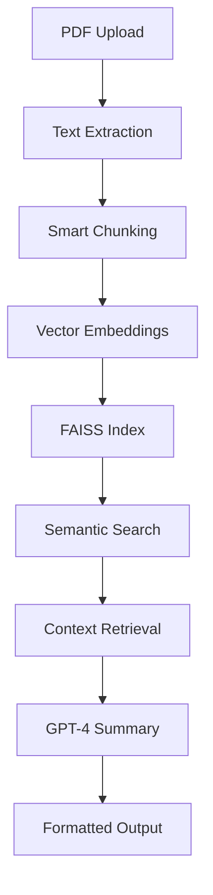

# 🤖 RAG-Powered PDF Summarizer

> **Transform your PDFs into intelligent summaries using cutting-edge AI technology**

[](your-app-url-here)
[](https://www.python.org/downloads/)
[](https://opensource.org/licenses/MIT)

---

## ✨ What Makes This Special?

This **Streamlit application** revolutionizes how you interact with PDF documents by combining **Retrieval-Augmented Generation (RAG)** with state-of-the-art AI models. Instead of reading through lengthy documents, get precise, context-aware summaries in seconds!

### 🎯 **Key Highlights**

- 🧠 **Smart RAG Technology**: Uses LangChain + FAISS for intelligent content retrieval
- 🎨 **Multiple Summary Styles**: Comprehensive, Brief, Bullet Points, or Executive summaries
- 🔍 **Topic-Specific Focus**: Ask about specific topics and get targeted insights
- 📊 **Real-time Processing**: Interactive Streamlit interface with live feedback
- 📚 **Multi-PDF Support**: Process multiple documents simultaneously
- ⚡ **Semantic Search**: Vector-based similarity matching for relevant content

---

## 🚀 Features That Set Us Apart

| Feature | Description | Benefit |
|---------|-------------|---------|
| **🤖 RAG Architecture** | Retrieval-Augmented Generation using LangChain & FAISS | More accurate, context-aware summaries |
| **🎯 Topic Targeting** | Focus on specific themes or questions | Get exactly what you're looking for |
| **📋 Summary Variety** | 4 different summary formats | Choose the perfect format for your needs |
| **⚙️ Customizable Parameters** | Adjust chunk size and overlap | Fine-tune for your specific documents |
| **📊 Smart Analytics** | Processing metrics and efficiency stats | Understand how your documents are analyzed |
| **💾 Export Ready** | Download summaries with metadata | Save and share your insights |

---

## 🛠️ Quick Start Guide

### Prerequisites

- Python 3.8 or higher
- OpenAI API key ([Get yours here](https://platform.openai.com/api-keys))

### 1️⃣ **Clone & Install**

```bash
git clone https://github.com/your-username/rag-pdf-summarizer.git
cd rag-pdf-summarizer
pip install -r requirements.txt
```

### 2️⃣ **Set Up Your API Key**

**Option A: Environment Variable**
```bash
export OPENAI_API_KEY="your-api-key-here"
```

**Option B: Create a `.env` file**
```
OPENAI_API_KEY=your-api-key-here
```

### 3️⃣ **Launch the App**

```bash
streamlit run app.py
```

🎉 **That's it!** Your app will open at `http://localhost:8501`

---

## 🎮 How to Use

### **Step 1: Upload Your PDFs** 📁
- Drag and drop your PDF files into the sidebar
- Support for multiple PDFs at once

### **Step 2: Choose Your Summary Style** 🎨
- **Comprehensive**: Detailed, thorough analysis
- **Brief**: Quick 2-3 paragraph overview  
- **Bullet Points**: Key insights in list format
- **Executive**: Decision-focused summary

### **Step 3: Optional Topic Focus** 🎯
- Enter a specific topic or question
- Get laser-focused summaries on exactly what you need

### **Step 4: Generate & Download** ⚡
- Click "Generate RAG Summary"
- View real-time processing updates
- Download your summary with metadata

---

## 🏗️ Technical Architecture



**Under the Hood:**
- **PyMuPDF (fitz)**: High-quality PDF text extraction
- **LangChain**: Advanced text processing and chunking
- **OpenAI Embeddings**: Semantic vector representations
- **FAISS**: Lightning-fast similarity search
- **GPT-4**: State-of-the-art language understanding

---

## 📦 Dependencies

```txt
streamlit                 # Interactive web interface
langchain_text_splitters # Smart document chunking
langchain_openai         # OpenAI integration
langchain_community      # FAISS vector store
langchain                # RAG orchestration
python-dotenv            # Environment management
PyMuPDF                  # PDF processing engine
```

---

## 🔧 Configuration Options

### **RAG Parameters** (Adjustable in sidebar)
- **Chunk Size**: 500-2000 characters (default: 1000)
- **Chunk Overlap**: 50-400 characters (default: 200)
- **Summary Type**: 4 different styles available

### **Advanced Settings**
- Temperature control for creativity vs. accuracy
- Custom prompt templates for different use cases
- Retrieval parameters for precision tuning

---

## 🌟 Use Cases

| Scenario | Benefit |
|----------|---------|
| **📚 Academic Research** | Quickly extract key findings from research papers |
| **💼 Business Reports** | Generate executive summaries for stakeholders |
| **📖 Document Review** | Identify specific topics across multiple documents |
| **🔍 Due Diligence** | Focus on particular aspects of legal/financial docs |
| **📝 Content Analysis** | Extract themes and insights from large documents |

---

## 🤝 Contributing

We love contributions! Here's how you can help:

1. **🍴 Fork the repository**
2. **🌿 Create a feature branch** (`git checkout -b feature/amazing-feature`)
3. **💾 Commit your changes** (`git commit -m 'Add amazing feature'`)
4. **🚀 Push to branch** (`git push origin feature/amazing-feature`)
5. **🎯 Open a Pull Request**

---

## 📄 License

This project is licensed under the MIT License - see the [LICENSE](LICENSE) file for details.

---

## ⭐ Support This Project

If this tool saves you time and effort, please:
- ⭐ **Star this repository**
- 🐛 **Report issues** you encounter
- 💡 **Suggest new features**
- 🔄 **Share with colleagues**

---

## 📞 Get Help

- 💬 **Discussions**: Use GitHub Discussions for questions
- 🐛 **Bug Reports**: Create an issue with reproduction steps  
- 💡 **Feature Requests**: We'd love to hear your ideas!
- 📧 **Contact**: [eksai0726@gmail.com](eksai0726@gmail.com)

---

<div align="center">

**Made with ❤️ using Python, Streamlit, and OpenAI**

*Turning your PDFs into actionable insights, one summary at a time*

</div>
